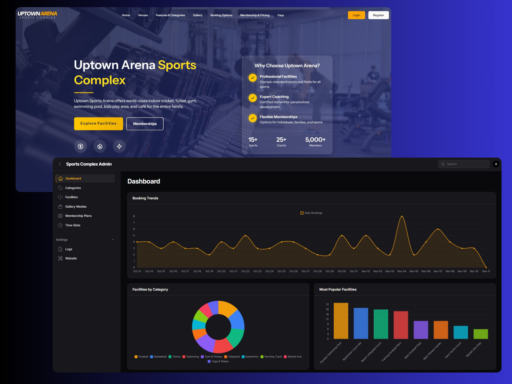

<p align="center">
  
</p>

# 🏟️ Sports Complex (Laravel + Filament)

A modern **Sports Complex** built with **Laravel** and **Filament Admin Panel**.  
This open-source project provides a complete solution for managing a sports facility — including **users, memberships, categories, facilities, time slots, gallery, logs, and site settings**.

Designed with scalability, performance, and simplicity in mind, this system can be easily extended or customized for any sports management platform.

<p align="center">
  
  
  
</p>

## 🌐 Live Demo

🔗 **[View Demo](https://your-demo-url.com)**  

---

## 🚀 Features

- ✅ User & Membership Management  
- 🏋️ Facility & Category Management  
- 🕒 Time Slot Scheduling  
- 🖼️ Gallery Management  
- 🧾 Admin Activity Logs  
- ⚙️ Dynamic Site Settings via Filament  
- 🧩 Modular & Extendable Architecture  

---

## 🧱 Tech Stack

| Layer | Technology |
|-------|-------------|
| **Backend** | Laravel 12+ |
| **Admin Panel** | FilamentPHP |
| **Frontend** | Blade + Tailwind CSS |
| **Database** | MySQL / PostgreSQL |
| **Authentication** | Laravel Breeze / Sanctum |
| **Deployment Ready** | PHP 8.2+, Composer, Artisan |

---

## 🛠️ Installation Guide

### 1️⃣ Clone the Repository
```bash
git clone https://github.com/AqibUllah/arean-sports-complex.git
cd sports-complex-management
composer install
npm install && npm run dev
cp .env.example .env
php artisan key:generate
php artisan migrate --seed
```

### 🔐 Default Admin Login
email:     admin@example.com
password:  password

### 🤝 Contributing
Contributions are welcome!
If you find a bug, have a feature request, or want to improve the project, feel free to:
1. Fork the repository
2. Create a new branch
3. Make your changes
4. Submit a pull request 🎉

### 🌍 Connect
If you use or like this project, consider giving it a ⭐ on GitHub!
Developed by Aqibullah
 — Full Stack Developer (Laravel + Filament + Vue.js)
